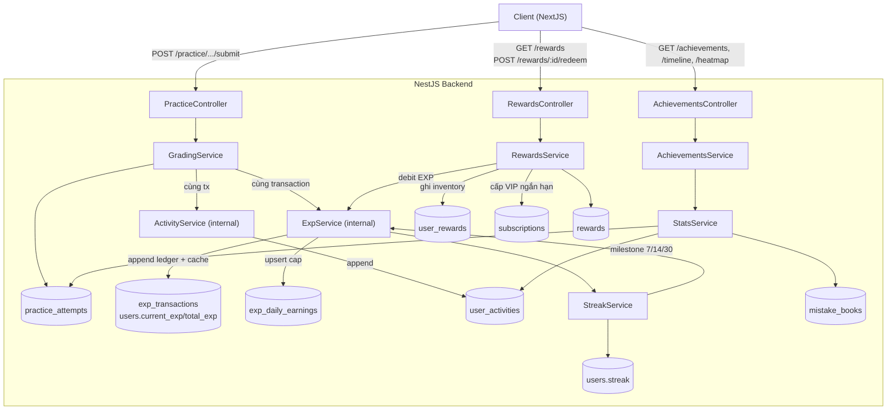

# ĐẶC TẢ PR-33
## Bảng Thành Tích Cá Nhân, Lịch Sử Học Tập & Hệ Thống Đổi Thưởng (Achievements & Rewards System)
*Thay thế mô hình Leaderboard truyền thống bằng bảng theo dõi cá nhân hóa toàn diện, cho phép người dùng nhìn lại chặng đường học tập, phân tích lỗi sai và sử dụng EXP cày được để đổi thưởng.*

---

| Thông tin | Nội dung |
| :--- | :--- |
| **Mã chức năng** | PR-33 |
| **Module** | Theo dõi tiến trình (Progress Tracking) & Thương mại (Commerce) |
| **Actor** | Student (Admin quản trị catalog đổi thưởng) |
| **Backend** | NestJS + TypeORM + PostgreSQL |
| **Frontend** | NextJS |
| **Phụ thuộc** | PR-17 (Sổ lỗi sai), `practice` (grading/submit), `subscription` (entitlement VIP), `student` (progress) |
| **Ưu tiên** | Cao (Tạo động lực, tối ưu lộ trình học và chuyển đổi doanh thu) |

---

## 1. Yêu cầu nghiệp vụ (Business Requirements)

Thay vì thi đua thứ hạng với người khác, hệ thống sẽ tập trung xây dựng một **"Không gian học tập cá nhân"**. Người dùng không chỉ thấy được các con số thống kê vô hồn, mà còn có thể xem chi tiết lại toàn bộ chặng đường học tập của mình (Timeline), ôn tập lại ngay những lỗi sai thường gặp (Mistake Book) và dùng điểm kinh nghiệm (EXP) tích lũy được để quy đổi lấy các phần quà có giá trị thực tế (khóa học, tính năng VIP).

### 1.1 Mục đích
1. **Theo dõi hành trình chi tiết:** Giúp người học nhìn lại được "Hôm nay mình đã làm gì?", "Tuần qua học được những từ nào?".
2. **Khắc phục điểm yếu:** Phân tích trực quan Sổ lỗi sai, cho phép ôn tập ngay lập tức.
3. **Tăng tỷ lệ giữ chân (Retention) & Chuyển đổi (Monetization):** Biến EXP thành đơn vị tiền tệ hữu ích để đổi Voucher hoặc tính năng VIP.

### 1.2 Ràng buộc nghiệp vụ (cốt lõi chống gian lận)
- **Không có endpoint public nào cộng EXP.** Mọi EXP chỉ do backend sinh ra từ hành động đã xác thực (grading attempt, ôn tập sổ lỗi, milestone streak).
- **Daily Cap:** Giới hạn EXP tối đa kiếm/ngày để chống lạm phát (§7).
- **EXP là ledger append-only:** Mỗi giao dịch nhận/tiêu ghi lại; số dư cache trên `users`.

---

## 2. Chi tiết các luồng chức năng (Functional Details)

### 2.1 Bảng Thống Kê & Chi Tiết Lịch Sử (Personal Dashboard & History)
Một màn hình chuyên biệt (hoặc một tab trong Profile) gồm các phần:

**A. Thống kê tổng quan:**
- **EXP hiện có:** Điểm đang có thể dùng để tiêu xài.
- **Chuỗi học (Streak):** Biểu đồ nhiệt (Heatmap) thể hiện mức độ chuyên cần.
- **Tổng quan:** Số từ vựng đã học, tổng số bài học đã hoàn thành.

**B. Dòng thời gian hoạt động (Activity Timeline):**
- Hiển thị chi tiết theo thời gian thực (Giống như Nhật ký học tập):
  - *VD: 14:30 - Hoàn thành bài học HSK 1 Bài 3 (+10 EXP).*
  - *VD: 15:00 - Luyện tập Game Viết Câu: Đúng 9/10 (+15 EXP).*
- Cho phép bộ lọc xem lại những bài đã học trong Tuần/Tháng.

**C. Sổ lỗi sai chi tiết (Mistake Book Deep-dive):**
- **Không chỉ hiện con số:** Liệt kê trực tiếp các từ vựng/mẫu câu sai nhiều nhất trong tuần qua.
- Hiển thị ngữ cảnh lúc làm sai (Làm sai ở game nào, đã điền đáp án sai là gì, đáp án đúng là gì).
- Nút **"Ôn tập ngay (Review Now)"**: Khởi tạo ngay một session game nhỏ (Flashcard/Match) chỉ chứa các từ vựng trong Sổ lỗi sai để người dùng khắc phục ngay lập tức.

### 2.2 Cơ chế thu thập Điểm thưởng (Earning Mechanics) — backend-side
| Hành động | EXP | Ghi chú |
| :--- | :--- | :--- |
| Hoàn thành bài học/bài tập mới | +10 | Khi `attempt` chuyển COMPLETED |
| Ôn tập thành công lỗi sai (Mistake Book) | +15 | Khuyến khích sửa sai |
| Đạt điểm tuyệt đối (Perfect Score) | +5 bonus | score = 100% |
| Combo đúng liên tiếp | +2/câu đúng từ câu thứ 3 | Trong một attempt |
| Hoàn thành Daily Goal | +20 | `dailyXp >= dailyGoal` |
| Milestone Streak 7/14/30 ngày | Rương EXP lớn (50/100/200) | Chỉ cộng 1 lần/mốc |

### 2.3 Cửa hàng Đổi thưởng (Reward Shop / Redemption)
Sử dụng EXP đã tích lũy để "mua" các vật phẩm hoặc quyền lợi:
1. **Đổi quyền lợi VIP ngắn hạn:** *VD* 500 EXP = Mở khóa "Chấm điểm Speaking bằng AI" trong 24 giờ.
2. **Đổi mã giảm giá (Discount Vouchers):** *VD* 2000 EXP = giảm 10% khóa học; 5000 EXP = giảm 30% gói VIP 1 năm.
3. **Mở khóa nội dung đặc biệt:** Bộ Flashcard cao cấp hoặc Bài Test độc quyền.
4. **Vật phẩm trang trí (Cosmetics):** Avatar đặc biệt, khung viền.

---

## 3. Thiết kế CSDL (Database Design)

### 3.1 Bảng `users` (cập nhật, thêm cột)
| Cột | Kiểu | Mô tả |
| :--- | :--- | :--- |
| `total_exp` | INT, default 0 | Tổng EXP tích lũy (cho cấp độ) |
| `current_exp` | INT, default 0 | EXP hiện có thể tiêu (cache từ ledger) |

> `currentStreak`, `lastActivityDate`, `dailyGoal` đã có sẵn — tái dùng.

### 3.2 Bảng `user_activities` — nhật ký hoạt động (Timeline source)
| Cột | Kiểu | Mô tả |
| :--- | :--- | :--- |
| `id` | UUID, PK | |
| `user_id` | UUID, FK → users | |
| `activity_type` | VARCHAR(30) | `COMPLETED_LESSON`, `PLAYED_GAME`, `REVIEWED_MISTAKES`, `EARNED_STREAK_CHEST` |
| `details` | JSONB | Tên bài, số điểm, EXP nhận, game type, combo… |
| `exp_awarded` | INT, default 0 | EXP cộng từ hoạt động này (để timeline hiện "+10 EXP") |
| `created_at` | TIMESTAMPTZ | |

**INDEX `(user_id, created_at DESC)`** — timeline phân trang. **Partition theo tháng** (§7 rủi ro phình to).

### 3.3 Bảng `exp_transactions` — ledger EXP append-only (source of truth)
| Cột | Kiểu | Mô tả |
| :--- | :--- | :--- |
| `id` | UUID, PK | |
| `user_id` | UUID, FK → users | |
| `amount` | INT | Dương = nhận, âm = tiêu |
| `type` | VARCHAR(30) | `EARN_LESSON`, `EARN_MISTAKE_REVIEW`, `EARN_PERFECT`, `EARN_COMBO`, `EARN_DAILY_GOAL`, `EARN_STREAK`, `SPEND_REDEEM` |
| `ref_type` | VARCHAR(30), nullable | `practice_attempt`, `mistake_review`, `streak_milestone`, `reward` |
| `ref_id` | UUID, nullable | ID đối tượng |
| `idempotency_key` | UUID, nullable | Chống cộng trùng |
| `created_at` | TIMESTAMPTZ | |

**Constraints:** `UNIQUE (user_id, idempotency_key)` WHERE `idempotency_key IS NOT NULL`; `INDEX (user_id, created_at DESC)`; `CHECK (amount != 0)`.

### 3.4 Bảng `exp_daily_earnings` — áp daily cap
| Cột | Kiểu | Mô tả |
| :--- | :--- | :--- |
| `user_id` | UUID, FK | |
| `date` | DATE | |
| `earned` | INT, default 0 | Tổng EXP nhận trong ngày |

**PK `(user_id, date)`** (upsert). `ExpService.award` cap mềm: chỉ cộng đến `MAX_DAILY_EXP` (env). Milestone streak **không** bị cap.

### 3.5 Bảng `mistake_books` (đang có — mở rộng tracking)
- Thêm cột `context` JSONB: `{ gameType, userAnswer, correctAnswer }` — ngữ cảnh lúc sai.
- `last_reviewed_at` đã có (PR-17).

### 3.6 Bảng `rewards` — catalog đổi thưởng (admin-managed)
| Cột | Kiểu | Mô tả |
| :--- | :--- | :--- |
| `id` | UUID, PK | |
| `code` | VARCHAR(50), UNIQUE | Slug (`vip_speaking_24h`) |
| `title` | VARCHAR(120) | |
| `type` | VARCHAR(30) | `DISCOUNT_VOUCHER`, `TEMPORARY_VIP`, `CONTENT_UNLOCK`, `COSMETIC` |
| `cost_exp` | INT | Giá EXP |
| `metadata` | JSONB | `% giảm, scope VIP, content_id, duration…` |
| `active` | BOOL, default true | |

### 3.7 Bảng `user_rewards` — inventory đã đổi
| Cột | Kiểu | Mô tả |
| :--- | :--- | :--- |
| `id` | UUID, PK | |
| `user_id` | UUID, FK | |
| `reward_id` | UUID, FK → rewards | |
| `type` | VARCHAR(30) | Snapshot `reward.type` |
| `metadata` | JSONB | Snapshot (voucher code thực, % giảm, hạn SD) |
| `is_used` | BOOL, default false | |
| `redeemed_at` | TIMESTAMPTZ | |
| `expires_at` | TIMESTAMPTZ, nullable | |

**INDEX `(user_id, is_used)`**. Voucher code thực sinh trong `metadata` khi redeem.

### 3.8 Bảng `subscriptions` (cập nhật — thêm scope, ADR-33-5)
| Cột | Kiểu | Mô tả |
| :--- | :--- | :--- |
| `scope` | JSONB, default `'[]'` | Mảng scope tính năng. `[]`/null = Full VIP; `['ai_speaking']` = VIP chỉ cho 1 tính năng (a-la-carte) |

> Entitlement check: user có Full VIP (`scope` rỗng/null) **HOẶC** VIP có `scope` chứa scope yêu cầu. Subscription hiện có (gói VIP trả phí) → `scope = []` (full). Redeem `TEMPORARY_VIP` → `scope` từ `reward.metadata.scope`.

---

## 4. Kiến trúc hệ thống (Architecture)

### 4.1 Sơ đồ kiến trúc & luồng dữ liệu



**Luồng award EXP + log activity (ví dụ nộp bài tập):**
1. Client `POST /practice/fill-blank/:id/submit`.
2. `GradingService.gradeFillBlank` chấm trong `dataSource.transaction(em)`.
3. **Cùng `em`**: `ExpService.awardFromAttempt({ userId, correct, total, combo }, em)` → ghi `exp_transactions` (+), upsert `exp_daily_earnings` (cap), cập nhật `users.current_exp/total_exp`.
4. **Cùng `em`**: `ActivityService.log({ userId, type: 'PLAYED_GAME', details, exp_awarded }, em)` → ghi `user_activities` (cho timeline).
5. `StreakService.recordActivity` → nếu chạm milestone 7/14/30 → `ExpService.award(EARN_STREAK)` (cùng `em`).
6. Transaction commit → attempt COMPLETED + EXP + activity nhất quán nguyên tử. Rollback → không cộng EXP/log oan.

**Luồng redeem (đổi thưởng):**
1. Client `POST /rewards/:id/redeem` (kèm `idempotencyKey`).
2. `RewardsService.redeem` trong `dataSource.transaction(em)`: load `rewards`, check `active` + đủ `current_exp`, `SELECT ... FOR UPDATE` lock row `users`, `ExpService.debit(cost, em)`, tạo `user_rewards` (sinh voucher code vào `metadata`), nếu `TEMPORARY_VIP` → insert/extend `subscriptions`.
3. Idempotent theo `idempotencyKey`.

### 4.2 Cấu trúc module backend

```text
backend/src/modules/achievements/
├─ achievements.module.ts
├─ exp.service.ts                  # award(), awardFromAttempt(), debit(), getBalance() — INTERNAL, không controller
├─ activity.service.ts             # log() — INTERNAL, ghi user_activities
├─ streak.service.ts               # recordActivity(), milestone detection 7/14/30
├─ achievements.controller.ts      # GET /achievements, /achievements/timeline, /achievements/heatmap
├─ achievements.service.ts         # aggregate stats (radar, missbook, ratios)
├─ rewards/
│  ├─ rewards.controller.ts        # GET /rewards, POST /rewards/:id/redeem, GET /rewards/inventory
│  └─ rewards.service.ts           # redemption logic + voucher code gen
├─ dto/
└─ entities/
   ├─ user-activity.entity.ts
   ├─ exp-transaction.entity.ts
   ├─ exp-daily-earnings.entity.ts
   ├─ reward.entity.ts
   └─ user-reward.entity.ts
```

> `ExpService` + `ActivityService` **không có controller** — chỉ `@Injectable()` inject vào `GradingService`, `PracticeAttemptService`, mistake-book review service, `RewardsService`.

### 4.3 API endpoints

| Method | Endpoint | Actor | Chức năng |
| :--- | :--- | :--- | :--- |
| GET | `/api/achievements` | Student | Dashboard: EXP, streak, tổng quan, radar, missbook stats |
| GET | `/api/achievements/timeline` | Student | Activity timeline (filter Tuần/Tháng, pagination) |
| GET | `/api/achievements/heatmap` | Student | Heatmap hoạt động 365 ngày |
| GET | `/api/rewards` | Student | Catalog shop (gray-out nếu thiếu EXP) |
| POST | `/api/rewards/:id/redeem` | Student | Đổi thưởng (idempotent) |
| GET | `/api/rewards/inventory` | Student | Voucher/item đã đổi |
| GET/POST/PATCH | `/api/admin/rewards` | Admin | CRUD catalog `rewards` |

**Hook nội bộ (không HTTP):** `GradingService` / `PracticeAttemptService.submit` / mistake-book review / `StreakService` milestone → `expService.award` + `activityService.log` (cùng tx).

---

## 5. Quyết định kiến trúc (ADRs)

### ADR-33-1: Cộng EXP + log activity qua service call nội bộ trong cùng transaction (không event bus)

**Status:** Accepted

**Context:** EXP/activity sinh từ nhiều nguồn (practice, exam, mistake review, streak). Cần (a) chống gian lận — client không tự cộng; (b) nguyên tử — EXP + activity + attempt cùng thành công/thất bại. Codebase hiện là NestJS monolith đồng bộ, chưa có `@nestjs/event-emitter`/queue.

**Decision:** `ExpService` + `ActivityService` nội bộ, gọi đồng bộ từ grading/submit service **trong cùng `dataSource.transaction(em)`**. Không thêm dependency event bus.

**Alternatives:**
- **`@nestjs/event-emitter` pub/sub** — tách biện tốt, nhưng phá nguyên tử trừ phi dùng transactional outbox; thêm dep cho MVP.
- **Client POST EXP** — loại bỏ (gian lận).

**Consequences:** + Nguyên tử, zero dep mới, validation tập trung. − Grading service phụ thuộc ExpService/ActivityService (chấp nhận, 1 import). Nếu số nguồn award tăng nhiều → xem xét event bus.

---

### ADR-33-2: EXP là ledger append-only + số dư cache trên `users`

**Status:** Accepted

**Context:** Cần số dư tiêu (`current_exp`), tổng tích lũy (`total_exp` cho cấp độ), lịch sử audit.

**Decision:** `exp_transactions` append-only là source of truth; `users.current_exp`/`total_exp` cache cập nhật cùng tx. Redeem = transaction âm.

**Alternatives:** **SUM on-the-fly** — chậm khi ledger lớn; **1 cột balance** — không audit.

**Consequences:** + Đọc balance O(1), audit đầy đủ, idempotent qua `idempotency_key`. − Phải giữ cache sync (cùng tx mitigates). Ledger lớn → partition/archive (NFR).

---

### ADR-33-3: Daily EXP cap qua `exp_daily_earnings` upsert

**Status:** Accepted

**Context:** Chống lạm phát EXP (§7). Giới hạn EXP/ngày/người.

**Decision:** Bảng `exp_daily_earnings(user_id, date, earned)`, PK `(user_id, date)`. `ExpService.award` upsert + cap mềm: chỉ cộng đến `MAX_DAILY_EXP` (env, VD 200). Milestone streak **không** bị cap.

**Consequences:** + Economy có giới hạn, upsert rẻ. − Chạm cap thì ngừng (chấp nhận, cap hào phóng). Tune qua env không deploy.

---

### ADR-33-4: Catalog đổi thưởng là bảng `rewards` (admin-managed), không hardcode

**Status:** Accepted

**Context:** Item shop thay đổi theo thời gian; cần tune giá/số dư không deploy.

**Decision:** Bảng `rewards` (`cost_exp`, `type`, `metadata`, `active`). Admin CRUD. Redeem snapshot vào `user_rewards`.

**Alternatives:** Hardcode config — không linh hoạt, không audit.

**Consequences:** + Tune không deploy, auditable. − Cần admin UI (defer vào module admin hiện có).

---

### ADR-33-5: VIP ngắn hạn & Quản lý Scope (Tính năng cụ thể)

**Status:** Accepted

**Context:** "500 EXP = AI Speaking 24h" — cấp entitlement có thời hạn nhưng chỉ cho 1 tính năng cụ thể, không phải Full VIP.

**Decision:** Thêm trường `scope` (JSONB mảng các chuỗi, ví dụ: `['ai_speaking']`) vào bảng `subscriptions`. Khi Redeem `TEMPORARY_VIP`, tạo subscription với scope tương ứng. Logic check entitlement sẽ kiểm tra xem user có Full VIP (scope rỗng/null) hoặc VIP có chứa scope yêu cầu hay không.

**Consequences:** + Mở rộng được mô hình bán lẻ (A la carte) tính năng. − Cần sửa nhẹ logic check VIP hiện tại ở backend.

---

### ADR-33-6: Timeline từ bảng `user_activities` riêng, không derive từ `exp_transactions`

**Status:** Accepted

**Context:** Timeline cần hành động phong phú (kể cả hành động không earn EXP, context chi tiết). `exp_transactions` là ledger tài chính, schema không phù hợp show "tên bài, game type".

**Decision:** Bảng `user_activities` riêng, `ActivityService.log` ghi cùng tx với EXP. `exp_awarded` field cho timeline hiện "+X EXP".

**Alternatives:** **Derive timeline từ `exp_transactions` + `practice_attempts` join** — phức tạp, thiếu hành động non-EXP, schema mismatch.

**Consequences:** + Timeline phong phú, query đơn. − Ghi 2 row (activity + exp_tx) cho 1 hành động — chấp nhận (khác mục đích). `user_activities` phình to → partition theo tháng (§7).

---

## 6. Yêu cầu phi chức năng (NFRs)

| Nhóm | Yêu cầu | Giải pháp |
| :--- | :--- | :--- |
| **Performance** | Đọc balance O(1) | Cache `users.current_exp` (ADR-2) |
| | Dashboard stats < 500ms | Query bounded 30 ngày; radar aggregate 1 query group-by |
| | Timeline phân trang | `INDEX (user_id, created_at DESC)` + cursor pagination |
| | Heatmap 365 ngày | Pre-aggregate từ `practice_attempts` group by date |
| **Security** | Không cộng EXP từ client | `ExpService` không controller (ADR-1) |
| | Redeem idempotent | `idempotencyKey` trên `exp_transactions` + `user_rewards` |
| | Rate-limit redeem | `ThrottlerGuard` (đã có) trên `/rewards/:id/redeem` |
| | Voucher code không lộ | Sinh khi redeem, lưu `user_rewards.metadata` |
| **Consistency** | EXP + activity + attempt nguyên tử | Cùng `em` transaction (ADR-1) |
| | Redeem (debit + grant) nguyên tử | Cùng `em` + `SELECT FOR UPDATE` lock users |
| **Scalability** | `user_activities` phình | Partition theo tháng; purge activity > 90 ngày (3 tháng) via cron (§11.3) |
| | `exp_transactions` phình | Partition theo tháng; **không xóa** (ledger đối soát vĩnh viễn, §11.3) |
| | Cap upsert rẻ | PK `(user_id, date)`, 1 row/user/ngày |
| **Observability** | Audit EXP + activity | Ledger + `user_activities` đầy đủ `type`, `ref`, `details` |

---

## 7. Rủi ro & Mitigation

| Rủi ro | Mitigation |
| :--- | :--- |
| **Lưu trữ Timeline/ledger phình to** | Purge (xóa) bảng `user_activities` các dòng cũ hơn **3 tháng (90 ngày)**. Vẫn giữ lại `exp_transactions` (không xóa vì là sổ cái tài chính). Thống kê tổng đã có `total_exp` cache lo. |
| **Lạm phát EXP (cày quá dễ → lỗ doanh thu)** | Khởi tạo Daily cap = **200 EXP/ngày** (ADR-3) + cân đối `cost_exp` (VD: AI Speaking 24h = 500 EXP, Voucher 10% = 2000 EXP); tune qua env/admin |
| **Gian lận EXP (giả request cộng điểm)** | Không có endpoint cộng EXP (ADR-1); award server-side từ attempt đã grading; `idempotency_key` chống trùng |
| **Race condition redeem (đổi 2 item cùng lúc vượt balance)** | `SELECT ... FOR UPDATE` lock row `users` trong tx redeem |
| **EXP oan khi rollback** | Award + log trong cùng `em` với grading → rollback toàn bộ |
| **Voucher code trùng/dò** | Sinh code entropy cao + unique check; valid khi `is_used=false` + chưa `expires_at` |
| **VIP ngắn hạn xung đột subscription hiện có** | Insert/extend: đang VIP → cộng dồn `expires_at`; FREE → insert mới |
| **Cân bằng kinh tế (Economy Balancing)** | Daily cap + benchmark `cost_exp` từ dữ liệu thật; seed giá khởi tạo rồi tune |

---

## 8. Giao diện (UI/UX)

- Giao diện **Dashboard** chia 3 tab: `Thống kê & Timeline` | `Sổ lỗi sai (Mistake Book)` | `Cửa hàng (Shop)`.
- Bottom Navigation: đổi icon `Leaderboard` → `Thành tích` (cúp/huy chương cá nhân).
- **Timeline:** đường thẳng dọc có node tròn (như lịch sử giao dịch ngân hàng / GitHub commits), lọc Tuần/Tháng, mỗi node hiện "giờ - hành động (+X EXP)".
- **Thống kê:** card EXP + cấp độ, streak heatmap, radar chart (Nghe/Viết/Ngữ pháp/Từ vựng), missbook stats.
- **Sổ lỗi sai:** card chứa từ vựng, chú thích đỏ chỉ lỗi sai phổ biến + ngữ cảnh (game nào, đáp án sai/đúng), nút CTA lớn xanh "Luyện tập lại" / "Ôn tập ngay".
- **Shop:** tab "Giảm giá khóa học" / "Tính năng VIP" / "Trang trí". Item thiếu EXP → gray-out + thanh tiến trình "cần thêm X EXP". Redeem thành công → modal reward + confetti; voucher code copy-able.
- Tuân thủ design system **Cute Panda Forest** (palette forest/lime, panda mascot, card soft-lime `#eaf3c5`, pill button `#5e7f26`).

---

## 9. Thứ tự triển khai (cho đội nhỏ)

1. Migration: thêm `users.total_exp/current_exp` + 5 bảng mới (`user_activities`, `exp_transactions`, `exp_daily_earnings`, `rewards`, `user_rewards`) + mở rộng `mistake_books.context` + index/constraint/partition.
2. `ExpService` (`award`, `awardFromAttempt`, `debit`, `getBalance`) + cap; `ActivityService.log`.
3. Hook `ExpService` + `ActivityService` vào `GradingService` + `PracticeAttemptService.submit` (cùng tx).
4. `StreakService` milestone 7/14/30 → award rương (refactor từ `StudentProgressService.recordActivity` hiện có).
5. `AchievementsController/Service` — dashboard stats + timeline + heatmap + radar.
6. `rewards` seed catalog + admin CRUD (module admin).
7. `RewardsService.redeem` + controller (idempotent, lock balance, grant VIP/voucher/content).
8. Frontend: trang Thành tích (3 tab) + Shop + Inventory (Cute Panda Forest).
9. Test: unit ExpService (cap, idempotent, debit), ActivityService, e2e redeem race, integration award-trong-tx.

---

## 10. Tiêu chí nghiệm thu (Acceptance Criteria)

PR-33 nghiệm thu khi:
- [ ] Hoàn thành bài tập → EXP tự cộng server-side + `user_activities` ghi timeline; **không có** API public cộng EXP.
- [ ] `exp_transactions` + `user_activities` ghi đầy đủ; `users.current_exp/total_exp` sync.
- [ ] Cùng attempt không cộng EXP 2 lần (`idempotency_key`).
- [ ] Daily cap hoạt động: vượt `MAX_DAILY_EXP` → cap (trừ streak milestone).
- [ ] Streak 7/14/30 → rương EXP cộng đúng 1 lần/mốc.
- [ ] Timeline: hiện hoạt động chi tiết (giờ, hành động, +EXP), lọc Tuần/Tháng, phân trang.
- [ ] Dashboard: EXP, streak heatmap, radar, missbook stats đúng (30 ngày).
- [ ] Mistake Book deep-dive: liệt kê từ sai + ngữ cảnh + nút "Ôn tập ngay" khởi session.
- [ ] Ôn tập thành công mistake → +15 EXP.
- [ ] Shop: catalog từ `rewards`, item thiếu EXP gray-out + tiến trình.
- [ ] Redeem: đủ EXP → trừ balance + tạo `user_rewards` + cấp quyền lợi; không đủ → từ chối.
- [ ] Redeem idempotent (cùng `idempotencyKey` → không trừ 2 lần).
- [ ] Race redeem song song không vượt balance (lock/atomic).
- [ ] VIP ngắn hạn hết hạn đúng `expires_at`.
- [ ] Admin CRUD `rewards` hoạt động.
- [ ] Purge `user_activities` > 90 ngày (cron); `exp_transactions` không bị xóa.

---

## 11. Cấu hình & Tham số hệ thống (System Configs)

Để giải quyết bài toán cân bằng kinh tế (Economy Balancing) và lộ trình thăng tiến, áp dụng các tham số sau cho bản MVP:

**11.1 Cấu hình giá trị (Pricing & Cap):**
- `MAX_DAILY_EXP` = **200 EXP**. Giúp người dùng phải cày ít nhất 2.5 ngày mới đổi được phần quà rẻ nhất, và 10 ngày cho voucher giá trị.
- Bảng giá khởi tạo (Seed catalog):
  - Quyền lợi AI Speaking 24h: **500 EXP**
  - Mở khóa bộ Flashcard HSK nâng cao: **1000 EXP**
  - Voucher giảm giá 10% khóa học: **2000 EXP**
  - Voucher giảm giá 30% gói VIP 1 năm: **5000 EXP**

**11.2 Hệ thống Cấp độ (Leveling System):**
Sử dụng công thức bậc thang cố định (Fixed thresholds) lưu tại Frontend/Backend config (không lưu DB) để kích thích thăng cấp nhanh giai đoạn đầu:
- Level 1: 0 - 100 EXP
- Level 2: 100 - 300 EXP
- Level 3: 300 - 600 EXP
- Level 4: 600 - 1000 EXP
- Level 5: 1000 - 1500 EXP
- Các level sau: Tăng dần step 500 EXP/level.

**11.3 Chính sách lưu trữ (Purge Policy):**
- Bảng `user_activities` (Timeline): Chỉ giữ lại dữ liệu trong **3 tháng (90 ngày)**. Chạy Cronjob dọn dẹp hàng ngày.
- Bảng `exp_transactions` (Ledger): **Không xóa**, lưu vĩnh viễn để đối soát. Việc purge Timeline không ảnh hưởng số dư tổng vì số dư lấy từ `users.current_exp/total_exp`.
