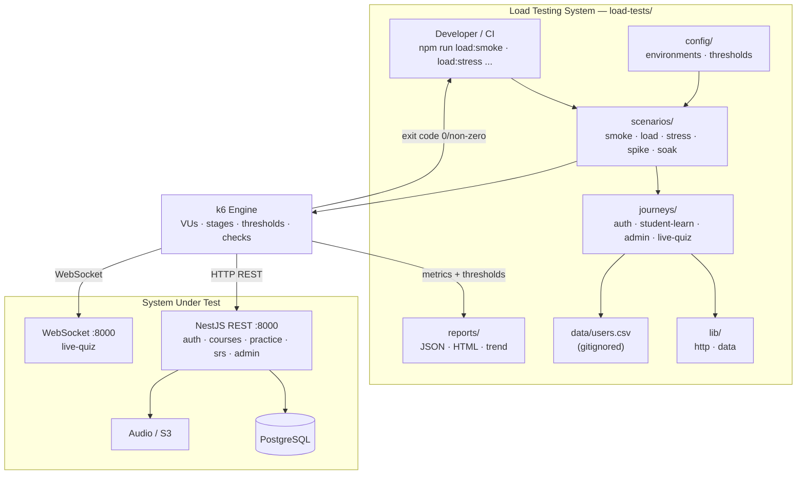

# Kiến trúc Hệ thống Load Test — Hanzi SRS

> Scope: subsystem load-test cho backend NestJS (:8000). Mục tiêu: xác minh hệ thống chịu tải tốt, tìm điểm gãy, phát hiện leak dưới tải duy trì.

## 1. Yêu cầu

### Functional
- Test nhiều endpoint qua **user journey** (không phải đánh 1 API).
- 4 journey chính: **Auth** (login/register/refresh), **Học sinh học/ôn** (browse → practice flashcard → SRS review → submit), **Admin curriculum** (CRUD courses/curriculum/question-bank), **Live-quiz realtime** (WebSocket).
- Token auth **tự acquire qua login flow** — KHÔNG hardcode JWT (token hiện tại trong `api-test.js` sẽ expire + rò rỉ secret).
- 5 load profile: `smoke`, `load`, `stress`, `spike`, `soak`.
- Ramp-up/down theo stages (không slam 1000 conn ngay lập tức như hiện tại).
- Report JSON + HTML, có **threshold pass/fail** → CI gate được.
- Target theo env: local / staging / prod (qua env var).

### Non-Functional
- **Performance**: p95 read < 200ms, p95 write < 500ms, p99 < 1000ms.
- **Scalability**: load 200–500 VU (peak trường/trung tâm), stress tới ~1000, spike 500 tức thời.
- **Maintainability**: journey là code reuse, scenario compose journey, config tách riêng. File < 200 dòng.
- **Reproducibility**: kết quả deterministic khi cùng config + env; test user seed cố định.
- **Security**: credential qua env/CSV gitignored, never commit token/secret.
- **Cost/Time**: smoke < 1 phút (chạy PR); load 10 phút (nightly); stress/spike/soak chạy manual/scheduled (tốn kém).

### Constraints
- Team JS/TS-fluent → tool JS-based.
- Backend NestJS + Postgres; live-quiz dùng WebSocket → cần test WS riêng.
- MVP, đội nhỏ → không over-engineer APM full enterprise; k6 metrics built-in là đủ, Grafana push là future.

## 2. Kiến trúc tổng quan



**Luồng**: CLI gọi scenario → scenario compose journey + load profile (từ config) → k6 engine sinh VU → mỗi VU chạy journey (login acquire token → các step REST/WS) → metrics gom về report + đánh threshold → exit code quyết định pass/fail CI.

## 3. Cấu trúc thư mục

```
load-tests/
├── config/
│   ├── environments.js     # baseUrl, creds ref theo env (local/staging/prod)
│   └── thresholds.js       # pass/fail criteria per profile
├── journeys/
│   ├── auth.js             # login → token (helper dùng chung, refresh 401)
│   ├── student-learn.js    # browse → practice → SRS review → submit
│   ├── admin-curriculum.js # admin CRUD courses/curriculum
│   └── live-quiz.js        # WS realtime flow (k6/net/ws)
├── scenarios/
│   ├── smoke.js            # 3 VU, 30s — sanity, chạy PR
│   ├── load.js             # ramp 50→200→500, 10m — peak bình thường
│   ├── stress.js           # ramp 500→800→1000, 5m — tìm điểm gãy
│   ├── spike.js            # 0→500 tức thời, hold 2m, drop — surge (mở lớp/thi)
│   └── soak.js             # 100 VU, 1h — leak memory/connection/DB pool
├── lib/
│   ├── http.js             # wrapper k6 http, gắn auth header, session per-VU
│   └── data.js             # random user/word picker, fixture factory
├── data/
│   └── users.csv           # credential test (GITIGNORED)
├── reports/                # output JSON+HTML (gitignored)
├── api-test.js             # GIỮ: autocannon micro-benchmark 1 endpoint
├── package.json            # scripts: load:smoke, load:load, load:stress, ...
├── .gitignore              # reports/, data/users.csv, node_modules
└── README.md               # cách chạy + điều kiện tiên quyết
```

## 4. Load profile (tier ≤500 VU)

| Profile | VU | Duration | Ramp | Mục đích | Khi chạy |
|---------|-----|----------|------|----------|----------|
| smoke | 3 | 30s | flat | Sanity — API up, journey pass | Mỗi PR (CI) |
| load | 50→200→500 | 10m | stages | Peak bình thường (trường học) | Nightly / pre-release |
| stress | 500→800→1000 | 5m | stages | Tìm điểm gãy, observe degrade | Manual / scheduled |
| spike | 0→500→0 | 2m | instant up, drop | Surge tức thời (mở lớp/thi) | Manual |
| soak | 100 | 1h | flat | Leak (mem/conn/DB pool) | Weekly scheduled |

## 5. Thresholds (k6 — pass/fail gate)

```js
// config/thresholds.js
export const read = {
  'http_req_failed{type:read}': ['rate<0.01'],          // error < 1%
  'http_req_duration{type:read}': ['p(95)<200', 'p(99)<1000'],
};
export const write = {
  'http_req_failed{type:write}': ['rate<0.01'],
  'http_req_duration{type:write}': ['p(95)<500', 'p(99)<1000'],
};
export const ws = {
  'ws_sessions': ['rate>0'],                              // WS connect thành công
  'ws_msg_failed': ['rate<0.02'],
};
export const checks = { checks: ['rate>0.99'] };          // assertion pass > 99%
// stress cho phép error rate lỏng hơn: rate<0.05
```

Tag mỗi request `type:read|write` để threshold lọc theo nhóm.

## 6. ADR — Architecture Decision Records

### ADR-001: k6 làm tool load-test chính
**Status**: Accepted
**Context**: Cần scenario-based test với user journey multi-step, ramp-up/down, threshold pass/fail, report, CI-friendly. `autocannon` hiện tại chỉ benchmark 1 endpoint, không có journey/threshold/report.
**Decision**: Dùng **Grafana k6** cho scenario/load test. Giữ `autocannon` (`api-test.js`) cho micro-benchmark 1 endpoint nhanh.
**Alternatives**:
- **Artillery** (Node.js, YAML/JS) — không cần binary ngoài, nhưng chậm hơn k6, report/threshold kém linh hoạt.
- **JMeter** — mature nhưng nặng, GUI/XML, không developer-friendly.
- **Locust** — Python, khác ecosystem team JS/TS.
- **autocannon-only** — mở rộng bằng code Node: thiếu thresholds/report/stages built-in, phải tự build nhiều.
**Consequences**: + Best-in-class scripting (JS/ES6), thresholds, stages, checks, HTML report, CI-friendly (Docker `grafana/k6`). − Cài 1 binary k6 (hoặc Docker) — nhẹ, single binary. − Team học k6 API (nhỏ, giống fetch).
**Trade-offs**: Đổi 1 dependency binary ngoài để lấy model scenario/threshold/report hoàn chỉnh — đáng cho mục tiêu "hệ thống load test" đúng nghĩa.

### ADR-002: Test theo user journey, không theo endpoint đơn lẻ
**Status**: Accepted
**Context**: Tải thực = hành vi user thật (login → browse → practice → review → submit). Đánh 1 endpoint 1000x không phản ánh bottleneck thật (VD: connection pool SRS review, N+1 query curriculum).
**Decision**: Mô hình hóa test thành **journey** multi-step có think-time, gộp nhiều journey theo trọng số trong 1 scenario.
**Consequences**: + Phản ánh thật, tìm được bottleneck thật. − Tốn công viết/maintain journey (mitigate: journey reuse qua mọi profile, lib chung).
**Trade-offs**: Độ chân thật > tốc độ viết test. Journey đầu tư 1 lần, dùng lại mọi profile.

### ADR-003: Token auth tự acquire qua login flow
**Status**: Accepted
**Context**: `api-test.js` hiện hardcode JWT trong cookie — token expire → test hỏng; token trong repo = rò rỉ secret (đang commit vào git).
**Decision**: Journey `auth.js` gọi `POST /auth/login` lấy token fresh, lưu per-VU trong k6 `vuState`; refresh khi gặp 401. Credential từ env var / `data/users.csv` (gitignored).
**Consequences**: + Test không expire, không leak secret. − Cần seed test user (admin + N student) trong DB target — document trong README.
**Trade-offs**: Thêm 1 bước setup seed user đổi lấy test xác định + an toàn secret.

### ADR-004: 5 load profile chuẩn (smoke/load/stress/spike/soak)
**Status**: Accepted
**Context**: Câu hỏi tải khác nhau cần hình test khác nhau (sanity vs peak vs điểm gãy vs surge vs endurance).
**Decision**: Định nghĩa 5 profile với VU/duration/ramp riêng (bảng mục 4). Smoke CI gate; load nightly; stress/spike/soak manual/scheduled.
**Consequences**: + Che phủ capacity/breaking-point/surge/endurance. − Nhiều script (mitigate: share journey+lib, profile chỉ khác config VU/stages).
**Trade-offs**: Đầu tư 5 profile nhẹ (cùng journey) để trả lời đủ loại câu hỏi tải.

### ADR-005: WebSocket (live-quiz) test tách riêng khỏi REST
**Status**: Accepted
**Context**: Live-quiz dùng WS — connection lâu, metric khác REST (connection count vs RPS). Trộn vào scenario REST làm sai metric + k6 executor khác (`per-vu`/`constant-arrival`).
**Decision**: Journey `live-quiz.js` + scenario riêng dùng `k6/net/ws`, executor và threshold riêng (`ws_sessions`, `ws_msg_failed`).
**Consequences**: + Metric WS sạch, không nhiễu REST. − 1 scenario thêm (chi phí nhỏ).
**Trade-offs**: Tách để đo đúng bản chất realtime, không ép WS vào khung REST.

## 7. Công nghệ — tóm tắt

| Layer | Tool | Lý do |
|-------|------|-------|
| Load engine | **k6** | JS scripting, stages, thresholds, checks, report, CI, WS support |
| Micro-benchmark | **autocannon** (giữ) | Nhanh cho 1 endpoint, đã có |
| Report | k6 JSON + HTML (`k6-reporter`) | CI gate + đọc nhanh |
| CI runner | Docker `grafana/k6` | Không cài binary, image chính thức |
| Trend (future) | k6 Cloud / Grafana | So sánh cross-run, regression — MVP chưa cần |

## 8. Rủi ro & Mitigation

| Rủi ro | Tác động | Mitigation |
|--------|----------|------------|
| Load test ghi/xóa data → ô nhiễm DB | Data rác, test sau sai | Dùng **test DB riêng** hoặc env load-test cô lập; test user idempotent; cleanup trong `teardown` |
| Token expire giữa test | Journey fail 401 | Per-VU login + refresh 401 (ADR-003) |
| Test staging làm hỏng test người khác | Kết quả sai, cản trở CI | Env load-test cô lập / chạy off-hours / dedicated runner |
| k6 binary chưa có trên máy dev | Không chạy được | Docker `grafana/k6` + README hướng dẫn cài 1 binary |
| Soak/stress tốn thời gian/tài nguyên | Chặn CI, tốn tiền | Chỉ smoke trên PR; load/stress/spike/soak manual/scheduled |
| Chạy local → kết quả không đại diện (CPU/IO dev) | Số liệu sai lệch | Document: local = indicative; số liệu chính thức chạy staging/runner riêng |
| WS metric trộn REST | Đo sai realtime | Tách scenario WS (ADR-005) |
| Test user chưa seed | Journey auth fail | README liệt kê điều kiện tiên quyết + seed script |

## 9. Điều kiện tiên quyết (prerequisites)
1. Backend chạy :8000 (hoặc env target) + DB reachable.
2. Test user đã seed: 1 admin + N student (credential trong `data/users.csv` hoặc env). Seed script nên có trong `backend/` (database/seeds).
3. k6 cài (`brew install k6` / `choco install k6` / Docker `grafana/k6`).
4. `data/users.csv` + `reports/` đã gitignore.

## 10. Next steps (đề xuất)
1. `planner` agent lập plan implement theo ADR này (phase: config → lib → journeys → scenarios → CI → README).
2. Di dời `api-test.js` hiện tại: bỏ hardcode token, giữ làm micro-benchmark (autocannon) — hoặc deprecate nếu k6 smoke bao phủ.
3. Seed test user trong backend (nếu chưa có).
4. (Future) Push k6 metrics → Grafana cho trend cross-run.

## 11. Câu hỏi đã resolve
- **Test DB cô lập**: KHÔNG cần — load test chạy local, DB local, thoải mái reset (xác nhận từ user). Cleanup teardown bỏ qua cho local.
- **Seed test user**: CÓ — `cd backend && npm run seed:users` tạo `admin@hanzi.dev` + `hocvien1-5@hanzi.dev` + 2 teacher (password `Test@1234`). Token pool dùng 8 user này.
- **live-quiz WS**: socket.io, namespace `/live-quiz`, cùng port 8000. Events `host_game`/`join_game`/`start_game`/`submit_answer`/`next_question`. Test bằng Node script `live-quiz-socket.js` (vì k6 không native support socket.io — tránh custom build `xk6-socketio`).
- **CI**: GitHub Actions (`.github/workflows/deploy-backend.yml` deploy EC2). Đã thêm `.github/workflows/load-smoke.yml` — manual + nightly, Docker `grafana/k6`, target URL qua input/secret `LOAD_TEST_BASE_URL`.

## 12. Tìm thấy khi explore code (ảnh hưởng design)
- **Auth = HttpOnly cookie** `access_token` (không phải Bearer body) → k6 cookie jar per-VU tự xử lý; `lib/http.js` set cookie từ token pool.
- **Login throttle 10/min/IP** (`@Throttle` trên `POST /auth/login`) → token pool trong `setup()` (≤8 login) share cho VU, KHÔNG hammer login trong default fn. Global throttle = 1M/min (dev → data endpoint không limit).
- **Response shape** `{ data, message }` (paginated: `{ data, meta, message }`) → `parseBody(res).data` uniform.
- **Practice attempt DTO**: `StartPracticeAttemptDto { practiceType: PracticeType, sourceType: SourceType, sourceId }` + `SubmitPracticeAttemptDto { score, correctCount, wrongCount, moveCount, durationSeconds }`. SRS review `{ vocabularyId, rating: AGAIN|HARD|GOOD|EASY }`.
