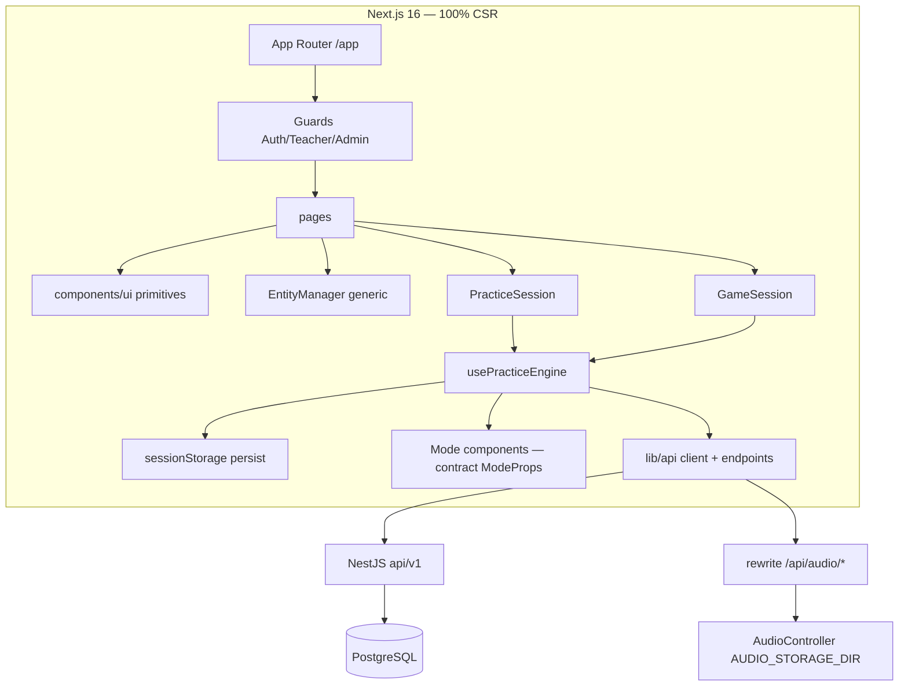

# Kiến trúc Frontend — Architecture Review

Scope: `frontend/src/**` — Next 16.3.0 App Router / React 19.2.8 / Tailwind v4 / TS strict / Vitest
Date: 2026-08-07 · Reviewer: architecture-designer skill

---

## 1. Tóm tắt kiến trúc hiện tại

**Pattern tổng thể: SPA toàn phần (100% CSR) chạy trên App Router.**
- 48/48 file TS/TSX trong `src/` đều khai báo `'use client'`. Không có Server Component,
  không route handler (`src/app/**/route.ts` = 0), không `middleware.ts`, không ISR/SSR.
- App Router chỉ đóng vai trò file-based router; mọi trang tự fetch dữ liệu ở client (`useEffect`).

**Các lớp:**
- `src/lib/api/` — `client.ts` (fetch wrapper: đính Bearer, bóc envelope, 401 → clearAuth + sự kiện `hanzi:unauthorized`), `endpoints.ts` (module-object theo domain: auth/curriculum/practice/test/subscription/resource), `types.ts` (mirror entity backend, viết tay — file lớn nhất, 321 dòng).
- `src/lib/auth/` — `AuthProvider` (JWT + user trong localStorage), guards client-side `AuthGuard`/`TeacherGuard`/`AdminGuard`.
- `src/lib/hooks/use-api.ts` — hook fetch khi mount + refetch theo tick (ít được dùng).
- `src/lib/utils/` — `cn`, `format`, `constants` (label + `activityKey`), `storage` (sessionStorage), `pinyin`.
- `src/components/ui/` — design system primitives (button/card/badge/spinner/modal/tabs/form/pagination/error-state/audio-button).
- `src/components/practice/` — `usePracticeEngine` (hook domain cốt lõi) + 4 mode + `source-loader` + `session`.
- `src/components/games/` — `GameSession` tái dùng chính engine đó + 3 mode + `hanzi-writer-canvas`.
- `src/components/admin/entity-manager.tsx` — CRUD generic cho màn admin.
- `src/app/**` — pages (mọi page = client + guard bao ngoài).

**Hai luồng nghiệp vụ chính:**
- **Luyện tập / trò chơi**: engine nạp từ vựng (`loadSourceVocab`) → `checkLimit` (peek, PR-14) → `start` attempt → sinh câu hỏi client-side → chấm điểm client-side → `submit` gửi DTO (điểm tin từ client). Session được persist vào sessionStorage.
- **Kiểm tra (PR-05)**: tải đề + câu → submit từng câu → **backend chấm server** (từng câu + tổng) → submit attempt → đọc điểm từ server.

### Diagram hiện tại

## 2. Điểm mạnh (đã verify)

- **Phân lớp sạch**: API layer tách khỏi UI; trang không gọi `fetch` trực tiếp, chỉ qua endpoints.
- **`usePracticeEngine` tái dùng cho cả practice lẫn games** — DRY đáng giá nhất của dự án.
- **Contract `ModeProps<TState>` thống nhất** cho 7 mode — thêm mode mới chỉ cần viết 1 component + 1 state.
- **`EntityManager` generic** dùng cho 5 màn admin (levels/lessons/vocab/grammar/questions).
- **Envelope khớp backend** `ok()`; 401 tự đăng xuất; JWT không bao giờ đặt trong URL.
- **Deps tối thiểu** (next/react/hanzi-writer/tailwind) — đúng YAGNI, không nợ thư viện.
- **8/8 finding review trước** đã fix/ghi nhận (xem resolution log trong `reviewer-260807-frontend.md`).
- Accessibility cơ bản: nút có aria-label, `prefers-reduced-motion` được tôn trọng.

## 3. Findings (xếp theo mức độ)

### P1-1. Toàn-CSR bỏ phí khả năng server của App Router
**File:** toàn bộ `src/app/**` (48 client, 0 server/middleware/route-handler).
**Hệ quả:**
- Không SEO cho trang công khai (`/`, `/contact`).
- First-paint chậm: blank page → tải JS → hydrate → fetch → render. Mọi trang đều nổ `PageLoading`.
- Không middleware → bundle của các trang protected (admin, teacher, profile) vẫn được ship cho mọi người dùng; guard chỉ redirect sau khi JS chạy.
**Trade-off:** MVP đa phần auth-gated + tương tác → CSR đơn giản, nhất quán, đúng nhu cầu. App Router thực tế đang trả phí (runtime) mà không dùng lợi ích.
**Khuyến nghị (KISS):** giữ CSR cho module tương tác (practice/tests/games); chuyển ~3 trang public (`/`, `/contact`, `/login`, `/register`) sang Server Component; thêm `middleware.ts` bảo vệ route (đọc cookie/token sớm). Không làm ISR/SSR dữ liệu phức tạp.

### P1-2. Guard quyền client-only — role đọc từ localStorage (tamper được)
**File:** `components/layout/{auth,teacher,admin}-guard.tsx`.
**Hệ quả:** user tự sửa `localStorage.hanzi_srs_user.role` → thấy UI admin/teacher; mọi call API vẫn bị backend chặn (đã verify hardening). Đây là defense-in-depth hợp lệ cho MVP nhưng cần middleware hoặc validate JWT mỗi navigation để nâng baseline.
**Khuyến nghị:** giữ nguyên cho MVP, ghi rõ trong docs là client-only gate; middleware (P1-1) sẽ chặn từ sớm.

### P1-3. Điểm luyện tập client-trusted — trust model không nhất quán với test
**File:** `components/practice/practice-models.ts:1-6`, `practice-engine.ts:148-166`.
**Hệ quả:** score/correct/wrong do client tính rồi gửi lên; `PracticeAttemptService` chỉ lưu DTO (bình luận trong code xác nhận). Test thì backend chấm (PR-05) — luyện tập thì không. Nếu sau này dùng attempt data làm thống kê/leaderboard/chứng chỉ → dữ liệu giả mạo được.
**Trade-off:** tự học, điểm thấp, không hại ai → chấp nhận được ở MVP.
**Khuyến nghị:** chấp nhận hiện tại; khi cần số liệu "có nghĩa" → chuyển sang server grading như test module.

### P1-4. Data fetching: boilerplate lặp lại, thiếu cache/dedup, vài chỗ thiếu cancellation guard
**File:** `lib/hooks/use-api.ts` (ít dùng); các trang tự viết `useEffect+useState(loading/error/data)`.
**Hệ quả:**
- 12+ trang duplicate cùng pattern; `useApi` đã có nhưng phần lớn page không dùng.
- Không cache giữa các lần điều hướng → quay lại trang nào cũng fetch lại.
- Thiếu guard `cancelled` ở `learn/page.tsx`, `profile/page.tsx`, `tests/join/page.tsx`, `resources/page.tsx` → race setState sau unmount.
**Khuyến nghị:** chuẩn hoá một hook `useAsync` (abort + cancelled + refetch) thay hết boilerplate; cache tầng API layer bằng Map đơn giản hoặc SWR nếu thấy cần. Không thêm React Query nếu chưa có yêu cầu thật.

### P2-5. `types.ts` mirror backend viết tay — drift risk
**File:** `lib/api/types.ts` (321 dòng, file lớn nhất dự án).
**Hệ quả:** backend đổi schema → frontend không nhận lỗi compile; phải sửa tay, dễ sót (chính loạt hardening vừa rồi đã phải đối chiếu tay).
**Khuyến nghị:** sinh type từ OpenAPI của NestJS (Swagger) bằng `openapi-typescript`, commit file sinh — 1 bước, loại bỏ drift.

### P2-6. 4 file > 200 dòng vi phạm rule modularize (CLAUDE.md)
**File:** `types.ts` (321), `endpoints.ts` (280), `app/tests/[testId]/page.tsx` (283), `app/teacher/tests/[testId]/page.tsx` (264).
**Hệ quả:** 2 page lớn nhất đang gộp luồng phức tạp (timer, form, modal, kết quả, danh sách attempt) trong 1 component → khó đọc, khó test.
**Khuyến nghị:** tách test page thành: `use-take-test` hook (state máy), `TestQuestionForm` (đã có), `TestResultCard`, `TimerBadge`; tách teacher page thành `QuestionModal` + `AttemptsList`.

### P2-7. `modeState` typed `unknown` → cast ở call-site
**File:** `practice-engine.ts:28`, `session.tsx:101-131`, `game-session.tsx:99-121`.
**Hệ quả:** mất type-safety; cast `as MatchingState | null` lặp lại.
**Khuyến nghị:** tham số hoá `usePracticeEngine<TState>` — engine không cần biết chi tiết state.

### P2-8. Trùng màn limit/finished giữa practice và games
**File:** `session.tsx:42-75` và `game-session.tsx:41-77` — duplicate 2 block JSX gần giống hệt.
**Khuyến nghị:** gộp thành `SessionFrame` (LimitScreen + SummaryCard) dùng chung.

### P2-9. `EntityManager` chỉ hỗ trợ create/delete — không update
**File:** `components/admin/entity-manager.tsx`.
**Hệ quả:** admin không sửa được cấp độ/bài/từ/ngữ pháp/câu hỏi dù API đều có PATCH. Cần tạo mới rồi xoá cũ.
**Khuyến nghị:** thêm edit mode (form fill từ row hiện tại) khi cần; không phải việc gấp cho MVP.

### P3-10. `showScoreImmediately=false` chưa enforced server-side
**File:** `app/tests/[testId]/page.tsx:154-178`.
**Hệ quả:** UI ẩn điểm nhưng client vẫn nhận `answers` có `isCorrect/pointsAwarded` và `attempt.score` — học viên bấm DevTools vẫn đọc được. Đã ghi nhận là unresolved backend issue (không phải lỗi frontend); frontend đã xử lý đúng theo spec UI.

## 4. Quyết định kiến trúc (ADR)

| ADR | Quyết định | Status |
| :--- | :--- | :--- |
| FE-001 | 100% CSR trên App Router cho MVP auth-gated | Existing — giữ, thu hẹp ở P1-1 |
| FE-002 | JWT trong localStorage + guard client-side; backend là nguồn sự thật | Existing — giữ, thêm middleware nếu mở rộng |
| FE-003 | Điểm luyện tập do client tính, backend lưu DTO | Existing — chấp nhận; server-grade khi cần số liệu đáng tin |
| FE-004 | Fetch layer tự viết (apiFetch + endpoints + useApi) | Existing — chuẩn hoá P1-4, chưa cần thư viện |
| FE-005 | Audio qua proxy rewrite `/api/audio/*` → backend | Existing — tốt; đổi CDN chỉ cần đổi env |
| FE-006 | (đề xuất) Thêm `middleware.ts` + RSC cho trang public | Proposed — low cost, raise baseline bảo mật + SEO |
| FE-007 | (đề xuất) Sinh types từ OpenAPI backend | Proposed — loại drift P2-5 |
| FE-008 | (đề xuất) Thêm test cho `usePracticeEngine` + `useApi` + `apiFetch` | Proposed — luồng limit/start là critical path, hiện chưa có test |

## 5. Rủi ro & giảm thiểu

- **Rủi ro drift schema** (P2-5): giảm bằng codegen types.
- **Rủi ro race fetch sau unmount** (P1-4): guard `cancelled`/`AbortController` trong hook chuẩn.
- **Rủi ro UI-spoofing quyền** (P1-2): backend đã enforce; thêm middleware.
- **Rủi ro điểm practice giả mạo** (P1-3): chấp nhận cho MVP; nếu có yêu cầu thống kê → server grading.
- **Rủi ro bảo trì page >200 dòng** (P2-6): tách hook/component như đề xuất.

## Câu hỏi chưa rõ

- Có kế hoạch đưa practice lên server-grading (giống PR-05) không, hay để client chấm vĩnh viễn?
- Public pages (`/`, `/contact`) có cần SEO/indexing không? (quyết định có làm RSC + metadata không)
- Có yêu cầu edit (PATCH) cho admin CRUD ở roadmap không?
- Dark mode: hiện chỉ theo `prefers-color-scheme` (hệ thống) — có cần toggle thủ công không?

---

## Resolution log (2026-08-07) — batch implement

| ID | Verdict | Action |
| :--- | :--- | :--- |
| P2-8 | FIXED | `session-frame.tsx` — gộp `LimitScreen` + `SummaryCard` dùng chung practice & games; `session.tsx` 175→122 dòng, `game-session.tsx` 125→116. |
| P2-7 | FIXED (một phần) | `usePracticeEngine<TState = unknown>` generic; session/games truyền union state (`PracticeModeState`/`GameModeState`); cast còn lại được TS kiểm tra theo union. |
| P1-4 | FIXED | Thêm `cancelled` flag ở learn/profile/tests-join/resources (chống setState sau unmount). Chuẩn hoá hook `useAsync` để dùng hết các trang — chưa làm (YAGNI, guard đã đủ). |
| P2-9 | FIXED | `EntityManager` thêm `config.update?` + nút Sửa + prefill form (JSON fields stringify); wire `updateQuestion/Level/Lesson/Vocabulary/Grammar/Topic`. |
| P2-6 | FIXED | `tests/[testId]` 283→153 dòng: tách `use-take-test.ts` (state máy + timer/submit), `test-result-card.tsx`, `test-question-nav.tsx`. Giữ nguyên logic timer đã fix (submitRef + setTimeout). |
| FE-008 | FIXED | `client.test.ts`: 11 test transport (Bearer, envelope, 401 clearAuth+event, message string/mảng, lỗi mạng, 204). Vitest 19→30 tests. |
| FE-006 | DEFERRED | Middleware + RSC bị chặn bởi mô hình token trong `localStorage` (middleware chạy server không đọc được; RSC không fetch được API auth-gated). Làm được khi chuyển auth sang cookie. |
| FE-007 | DEFERRED | Backend chưa có `@nestjs/swagger` — cần thêm Swagger backend trước, mới sinh types được. |
| P2-5 | DEFERRED | Types vẫn mirror tay; bản chất chỉ hết khi có codegen (FE-007). |

Verify: `tsc --noEmit` 0 lỗi · `eslint` 0 lỗi (12 warning tồn đọng) · `vitest` 30/30 · `next build` 23/23.

Code review (code-reviewer agent, `reviewer-260807-frontend-arch-batch.md`): 6/6 điểm pass, không defect chặn. Xử lý nit F5 (bỏ `submitRef` khỏi return hook không dùng). Các Low còn lại (F1 restore cast tiền-tồn-tại, F2 update no-op không chạm được, F3 select trống khi options chưa load, F4 JSON prefill) không cần hành động.
